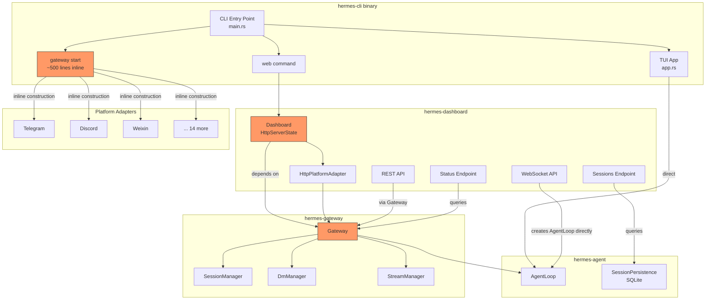
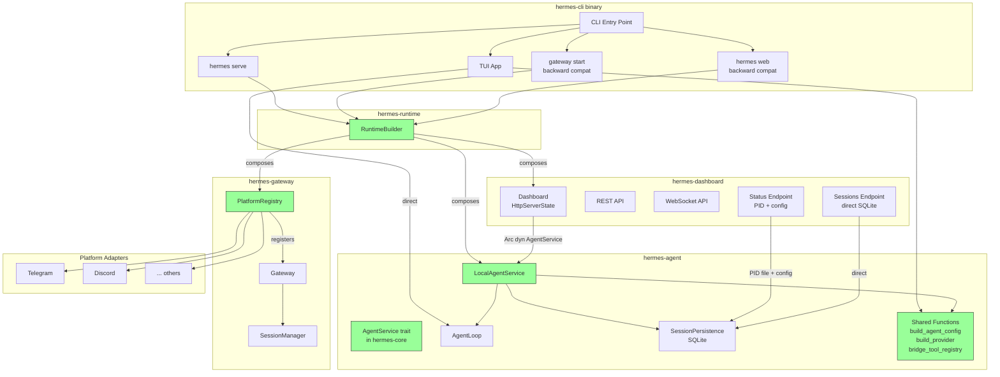
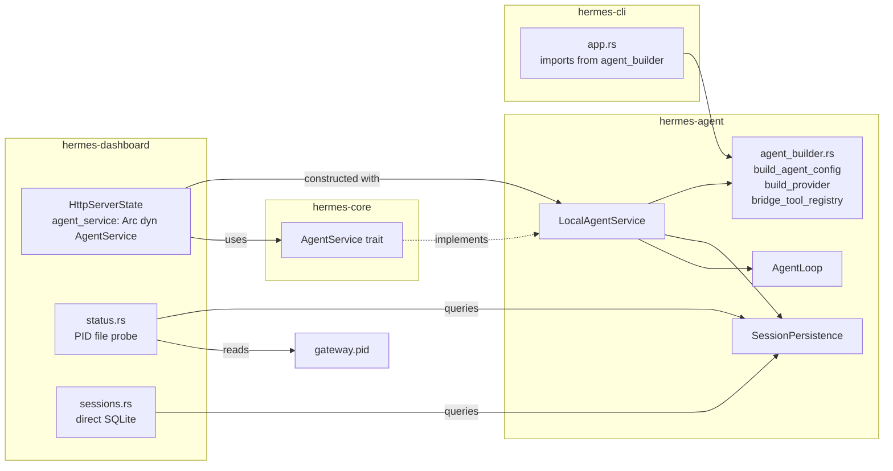
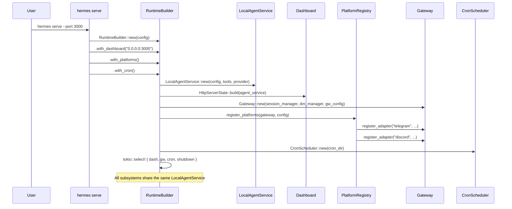

# Design Document: Unified Runtime Architecture

## Overview

This design describes a phased refactoring of the Hermes Agent system to decouple the Dashboard from the Gateway, introduce a unified runtime crate, and prepare for future process separation via a message bus.

**Problem**: The Dashboard currently depends on `hermes-gateway` to handle agent interactions, even though it doesn't need platform adapters, DM authorization, or slash command routing. The TUI already works without Gateway (it directly uses `AgentLoop`), proving the pattern is viable. Additionally, agent construction logic (`build_agent_config`, `build_provider`, `bridge_tool_registry`) is duplicated between `hermes-cli/src/app.rs` and `hermes-dashboard/src/lib.rs`. Platform registration is inlined in `hermes-cli/src/main.rs` (~500 lines of adapter construction), making it impossible to reuse from a new `hermes serve` command.

**Solution**: Introduce an `AgentService` trait in `hermes-core`, implement it as `LocalAgentService` in `hermes-agent`, refactor Dashboard to use it, extract platform registration, create a `hermes-runtime` crate with `RuntimeBuilder`, and define message bus interfaces for future process separation.

### Current Architecture (Before)



### Target Architecture (After — Phase 2 Complete)



## Architecture

### Phase 1: AgentService + Dashboard Decoupling

Phase 1 introduces the `AgentService` abstraction and removes the Dashboard's dependency on Gateway.

**Key decisions:**

1. **AgentService in hermes-core**: The trait lives in `hermes-core::traits` alongside `LlmProvider`, `PlatformAdapter`, etc. This avoids circular dependencies — `hermes-agent` implements it, `hermes-dashboard` consumes it, neither needs to know about the other.

2. **LocalAgentService in hermes-agent**: Wraps `AgentLoop` + `SessionPersistence` + `ToolRegistry` + `LlmProvider`. Manages session state via SQLite (the same `SessionPersistence` already used for conversation storage). This mirrors how the TUI's `App` struct works, but behind a trait.

3. **Shared construction functions in hermes-agent**: `build_agent_config`, `build_provider`, and `bridge_tool_registry` move from `hermes-cli/src/app.rs` to `hermes-agent/src/agent_builder.rs`. The CLI and Dashboard both import from there. The Dashboard's duplicate copies in `hermes-dashboard/src/lib.rs` are deleted.

4. **Status endpoint uses PID file**: Instead of querying `gateway.adapter_names()`, the status endpoint reads `$HERMES_HOME/gateway.pid`, probes the process with `kill(pid, 0)`, and reports gateway status. Session count comes from a `SELECT COUNT(*) FROM sessions` query.

5. **Session endpoints already query SQLite**: The current `sessions.rs` already queries SQLite directly. The only change is removing the `gateway` field from `HttpServerState` and ensuring no session endpoint touches Gateway.



### Phase 2: hermes-runtime + Unified Serve

Phase 2 extracts platform registration and creates a unified runtime.

**Key decisions:**

1. **PlatformRegistry in hermes-gateway**: The ~500 lines of adapter construction code in `main.rs::register_gateway_adapters` moves to `hermes-gateway/src/platform_registry.rs`. This is a natural home — it already depends on all platform adapter types.

2. **hermes-runtime crate**: A thin composition layer. `RuntimeBuilder` takes a `GatewayConfig` and lets callers opt into Dashboard, platforms, and cron. It creates a single `LocalAgentService` shared across all subsystems.

3. **`hermes serve` command**: Uses `RuntimeBuilder` with all subsystems enabled by default. Flags `--no-dashboard`, `--no-platforms`, `--no-cron` disable individual subsystems.

4. **Backward compatibility**: `hermes gateway start` becomes `RuntimeBuilder::new(config).with_platforms().with_cron().run()`. `hermes web` becomes `RuntimeBuilder::new(config).with_dashboard(addr).run()`.



### Phase 3: Message Bus (Architecture Ready)

Phase 3 defines interfaces only — no runtime behavior changes.

**Key decisions:**

1. **hermes-bus crate**: Defines message types (`AgentRequest`, `AgentResponse`, etc.) and a `BusTransport` trait. Includes an `InProcessTransport` using `tokio::sync::mpsc`.

2. **RemoteAgentService stub**: Implements `AgentService` by serializing requests to `BusTransport`. This is a stub — it compiles and has the right shape, but isn't wired into any runtime path yet.

3. **Serde on all message types**: Every message type derives `Serialize`/`Deserialize` so future transports (Unix socket, TCP) can serialize them.

## Components and Interfaces

### AgentService Trait (hermes-core)

```rust
/// Abstraction for agent execution — callers are agnostic about
/// whether the agent runs in-process or remotely.
#[async_trait]
pub trait AgentService: Send + Sync {
    /// Send a message to a session and get the reply.
    async fn send_message(
        &self,
        session_id: &str,
        text: &str,
        overrides: AgentOverrides,
    ) -> Result<AgentReply, AgentError>;

    /// Send a message and stream back chunks followed by a final reply.
    async fn send_message_stream(
        &self,
        session_id: &str,
        text: &str,
        overrides: AgentOverrides,
        on_chunk: Arc<dyn Fn(StreamChunk) + Send + Sync>,
    ) -> Result<AgentReply, AgentError>;

    /// Get all messages for a session.
    async fn get_session_messages(
        &self,
        session_id: &str,
    ) -> Result<Vec<Message>, AgentError>;

    /// Clear a session's message history.
    async fn reset_session(
        &self,
        session_id: &str,
    ) -> Result<(), AgentError>;
}

/// Optional overrides for a single request.
#[derive(Debug, Clone, Default)]
pub struct AgentOverrides {
    pub model: Option<String>,
    pub personality: Option<String>,
}

/// Reply from an agent execution.
#[derive(Debug, Clone)]
pub struct AgentReply {
    pub text: String,
    pub message_count: usize,
}
```

### LocalAgentService (hermes-agent)

```rust
pub struct LocalAgentService {
    config: Arc<GatewayConfig>,
    tool_registry: Arc<ToolRegistry>,
    session_persistence: Arc<SessionPersistence>,
}

impl LocalAgentService {
    pub fn new(
        config: Arc<GatewayConfig>,
        tool_registry: Arc<ToolRegistry>,
        session_persistence: Arc<SessionPersistence>,
    ) -> Self { ... }
}

#[async_trait]
impl AgentService for LocalAgentService {
    async fn send_message(&self, session_id, text, overrides) -> Result<AgentReply, AgentError> {
        // 1. Load session messages from SessionPersistence
        // 2. Append user message
        // 3. Build AgentConfig + provider using shared functions
        // 4. Create AgentLoop, call .run(messages)
        // 5. Persist updated messages
        // 6. Return assistant reply
    }

    async fn send_message_stream(&self, session_id, text, overrides, on_chunk) -> Result<AgentReply, AgentError> {
        // Same as above but uses .run_stream() with on_chunk callback
    }

    async fn get_session_messages(&self, session_id) -> Result<Vec<Message>, AgentError> {
        self.session_persistence.load_session(session_id)
    }

    async fn reset_session(&self, session_id) -> Result<(), AgentError> {
        // Delete session from SQLite
    }
}
```

### Shared Agent Builder (hermes-agent/src/agent_builder.rs)

Moves these functions from `hermes-cli/src/app.rs`:

- `build_agent_config(config: &GatewayConfig, model: &str) -> AgentConfig`
- `build_provider(config: &GatewayConfig, model: &str) -> Arc<dyn LlmProvider>`
- `bridge_tool_registry(tools: &ToolRegistry) -> AgentToolRegistry`
- `provider_api_key_from_env(provider: &str) -> Option<String>`

The CLI's `app.rs` and Dashboard's `lib.rs` both re-export or import from `hermes_agent::agent_builder`.

### PlatformRegistry (hermes-gateway/src/platform_registry.rs)

```rust
pub struct RegistrationSummary {
    pub registered: Vec<String>,
    pub errors: Vec<(String, String)>,
}

/// Register all enabled platform adapters from config.
pub async fn register_platforms(
    gateway: &Gateway,
    config: &GatewayConfig,
) -> Result<RegistrationSummary, AgentError> {
    // Iterates config.platforms, constructs adapters, registers with gateway
    // Returns summary of what was registered and any errors
}
```

### RuntimeBuilder (hermes-runtime)

```rust
pub struct RuntimeBuilder {
    config: GatewayConfig,
    dashboard_addr: Option<SocketAddr>,
    enable_platforms: bool,
    enable_cron: bool,
}

impl RuntimeBuilder {
    pub fn new(config: GatewayConfig) -> Self { ... }
    pub fn with_dashboard(mut self, addr: SocketAddr) -> Self { ... }
    pub fn with_platforms(mut self) -> Self { ... }
    pub fn with_cron(mut self) -> Self { ... }

    /// Start all configured subsystems. Blocks until shutdown signal.
    pub async fn run(self) -> Result<(), AgentError> {
        // 1. Build shared LocalAgentService
        // 2. Optionally start Dashboard
        // 3. Optionally register platforms via PlatformRegistry
        // 4. Optionally start CronScheduler
        // 5. tokio::select! on all + ctrl_c shutdown
    }
}
```

### Message Bus Types (hermes-bus)

```rust
#[derive(Serialize, Deserialize)]
pub enum BusMessage {
    AgentRequest(AgentRequest),
    AgentResponse(AgentResponse),
    PlatformIncoming(PlatformIncoming),
    PlatformOutgoing(PlatformOutgoing),
    SessionQuery(SessionQuery),
    SessionResponse(SessionResponse),
    CronTrigger(CronTrigger),
    StatusQuery(StatusQuery),
}

#[async_trait]
pub trait BusTransport: Send + Sync {
    async fn send(&self, message: BusMessage) -> Result<(), BusError>;
    async fn receive(&self) -> Result<BusMessage, BusError>;
}

pub struct InProcessTransport { /* tokio::sync::mpsc channels */ }
```

### RemoteAgentService (hermes-bus)

```rust
pub struct RemoteAgentService {
    transport: Arc<dyn BusTransport>,
}

#[async_trait]
impl AgentService for RemoteAgentService {
    async fn send_message(&self, session_id, text, overrides) -> Result<AgentReply, AgentError> {
        let request = AgentRequest { session_id, text, overrides };
        self.transport.send(BusMessage::AgentRequest(request)).await?;
        match self.transport.receive().await? {
            BusMessage::AgentResponse(resp) => Ok(resp.into()),
            _ => Err(AgentError::Io("unexpected message type".into())),
        }
    }
    // ... other methods follow same pattern
}
```

## Data Models

### AgentService Types (hermes-core)

```rust
/// Overrides for a single agent request.
#[derive(Debug, Clone, Default, Serialize, Deserialize)]
pub struct AgentOverrides {
    pub model: Option<String>,
    pub personality: Option<String>,
}

/// Reply from agent execution.
#[derive(Debug, Clone, Serialize, Deserialize)]
pub struct AgentReply {
    /// The assistant's text response.
    pub text: String,
    /// Total message count in the session after this exchange.
    pub message_count: usize,
}
```

### Bus Message Types (hermes-bus)

```rust
#[derive(Debug, Clone, Serialize, Deserialize)]
pub struct AgentRequest {
    pub session_id: String,
    pub text: String,
    pub overrides: AgentOverrides,
    pub stream: bool,
}

#[derive(Debug, Clone, Serialize, Deserialize)]
pub struct AgentResponse {
    pub session_id: String,
    pub text: String,
    pub message_count: usize,
    pub error: Option<String>,
}

#[derive(Debug, Clone, Serialize, Deserialize)]
pub struct PlatformIncoming {
    pub platform: String,
    pub chat_id: String,
    pub user_id: String,
    pub text: String,
    pub message_id: Option<String>,
    pub is_dm: bool,
}

#[derive(Debug, Clone, Serialize, Deserialize)]
pub struct PlatformOutgoing {
    pub platform: String,
    pub chat_id: String,
    pub text: String,
    pub parse_mode: Option<String>,
}

#[derive(Debug, Clone, Serialize, Deserialize)]
pub struct SessionQuery {
    pub session_id: Option<String>,
    pub search_query: Option<String>,
    pub limit: Option<u32>,
    pub offset: Option<u32>,
}

#[derive(Debug, Clone, Serialize, Deserialize)]
pub struct SessionResponse {
    pub sessions: Vec<SessionSummary>,
    pub total: u32,
}

#[derive(Debug, Clone, Serialize, Deserialize)]
pub struct SessionSummary {
    pub id: String,
    pub model: Option<String>,
    pub platform: Option<String>,
    pub title: Option<String>,
    pub message_count: u32,
    pub created_at: String,
    pub updated_at: String,
}

#[derive(Debug, Clone, Serialize, Deserialize)]
pub struct CronTrigger {
    pub job_id: String,
    pub prompt: String,
    pub scheduled_at: String,
}

#[derive(Debug, Clone, Serialize, Deserialize)]
pub struct StatusQuery {
    pub include_platforms: bool,
    pub include_sessions: bool,
}
```

### Dashboard HttpServerState Changes

```rust
// Before (current)
pub struct HttpServerState {
    pub config: Arc<GatewayConfig>,
    pub tool_registry: Arc<ToolRegistry>,
    pub hermes_home: PathBuf,
    pub session_persistence: Arc<SessionPersistence>,
    pub cron_scheduler: Option<Arc<CronScheduler>>,
    pub skill_store: Option<Arc<dyn SkillStore>>,
    gateway: Arc<Gateway>,           // ← REMOVED
    outbound: ChatOutboundBuffer,    // ← REMOVED
}

// After (Phase 1)
pub struct HttpServerState {
    pub config: Arc<GatewayConfig>,
    pub tool_registry: Arc<ToolRegistry>,
    pub hermes_home: PathBuf,
    pub session_persistence: Arc<SessionPersistence>,
    pub cron_scheduler: Option<Arc<CronScheduler>>,
    pub skill_store: Option<Arc<dyn SkillStore>>,
    pub agent_service: Arc<dyn AgentService>,  // ← NEW
}
```

### Status Endpoint Response (unchanged schema)

The `StatusResponse` JSON schema remains identical. The implementation changes from querying Gateway to:

| Field | Before | After |
|-------|--------|-------|
| `version` | `CARGO_PKG_VERSION` | `CARGO_PKG_VERSION` (same) |
| `hermes_home` | `state.hermes_home` | `state.hermes_home` (same) |
| `active_sessions` | `gateway.session_manager().session_count()` | `SELECT COUNT(*) FROM sessions` |
| `gateway_running` | `adapter.is_running()` loop | `kill(pid, 0)` on `gateway.pid` |
| `gateway_pid` | `None` | Read from `gateway.pid` file |
| `gateway_platforms` | `gateway.adapter_names()` loop | Empty map (platforms not in this process) |


## Correctness Properties

*A property is a characteristic or behavior that should hold true across all valid executions of a system — essentially, a formal statement about what the system should do. Properties serve as the bridge between human-readable specifications and machine-verifiable correctness guarantees.*

### Property 1: Session persistence round-trip

*For any* list of valid messages (with varying roles, content lengths, tool calls, and tool_call_ids), persisting them to a session via `SessionPersistence` and then loading them via `get_session_messages` should produce a list of messages with identical roles, content, tool_call_ids, and tool_calls.

**Validates: Requirements 1.3, 2.2, 5.2**

### Property 2: Session count matches persisted sessions

*For any* set of N distinct session IDs (where N ≥ 0), after persisting one or more messages to each session, querying the session count from SQLite should return exactly N.

**Validates: Requirements 4.4**

### Property 3: send_message appends user message and assistant reply to session

*For any* valid session ID and non-empty user message text, calling `LocalAgentService.send_message` (with a mock LLM provider that returns a deterministic reply) should result in the session containing at least the user message and an assistant reply message, with the user message content matching the input text.

**Validates: Requirements 2.3**

### Property 4: Platform registration matches enabled config

*For any* `GatewayConfig` with a subset of platforms set to `enabled: true` (with valid tokens/credentials), calling `register_platforms` should register adapters whose names are exactly the set of enabled platform names, and should not register any disabled platforms.

**Validates: Requirements 6.2, 6.3, 6.5, 13.5**

### Property 5: Bus message serde round-trip

*For any* valid `BusMessage` variant (AgentRequest, AgentResponse, PlatformIncoming, PlatformOutgoing, SessionQuery, SessionResponse, CronTrigger, StatusQuery), serializing to JSON and deserializing back should produce a value equal to the original.

**Validates: Requirements 10.5**

### Property 6: InProcessTransport send-receive round-trip

*For any* valid `BusMessage`, sending it through `InProcessTransport` and then receiving should produce a message equal to the original.

**Validates: Requirements 10.4**

### Property 7: REST API response schema stability

*For any* valid request to the status endpoint (`/api/status`), the response JSON should contain all required fields (`version`, `hermes_home`, `config_path`, `active_sessions`, `gateway_running`) with their expected types, matching the existing `StatusResponse` schema.

**Validates: Requirements 9.3**

## Error Handling

### AgentService Errors

All `AgentService` methods return `Result<_, AgentError>`. Error propagation follows the existing hierarchy:

| Error Scenario | Error Type | Handling |
|---|---|---|
| LLM provider fails | `AgentError::LlmApi` | Propagated to caller; Dashboard returns HTTP 502 |
| Session not found | `AgentError::Io` | `get_session_messages` returns empty vec (not an error) |
| SQLite I/O failure | `AgentError::Io` | Propagated; Dashboard returns HTTP 500 |
| Tool execution fails | `AgentError::ToolExecution` | Handled within AgentLoop (tool error message added to conversation) |
| Budget exceeded | `AgentError::MaxTurnsExceeded` | AgentLoop stops; partial result returned |
| Interrupted | `AgentError::Interrupted` | AgentLoop stops; partial result returned |

### PlatformRegistry Errors

`register_platforms` does not fail on individual adapter errors. It collects errors in `RegistrationSummary.errors` and continues registering remaining adapters. This matches the current behavior where a failed Telegram adapter doesn't prevent Discord from starting.

### RuntimeBuilder Errors

- If Dashboard fails to bind its address, `run()` returns `AgentError::Io`.
- If no subsystems are enabled, `run()` returns immediately (not an error).
- Graceful shutdown: on SIGTERM/SIGINT, all subsystems are stopped in reverse order (cron → platforms → dashboard).

### Bus Transport Errors

`BusTransport::send` and `receive` return `Result<_, BusError>`. `BusError` is a new error type in `hermes-bus`:

```rust
#[derive(Debug, thiserror::Error)]
pub enum BusError {
    #[error("transport closed")]
    Closed,
    #[error("serialization error: {0}")]
    Serialization(String),
    #[error("timeout")]
    Timeout,
}
```

`RemoteAgentService` converts `BusError` to `AgentError::Io` for callers.

### Status Endpoint Error Handling

- If `gateway.pid` doesn't exist: `gateway_running: false`, `gateway_pid: null`
- If PID file exists but process is dead: `gateway_running: false`, `gateway_pid: <stale_pid>` (and optionally clean up stale file)
- If SQLite is inaccessible: `active_sessions: 0` (graceful degradation, not an error response)

## Testing Strategy

### Unit Tests

**AgentService trait + LocalAgentService:**
- Test `send_message` with a mock `LlmProvider` that returns a fixed response. Verify session persistence contains user message + assistant reply.
- Test `send_message_stream` with a mock streaming provider. Verify chunks are forwarded to callback.
- Test `get_session_messages` returns persisted messages.
- Test `reset_session` clears messages.

**Shared agent builder functions:**
- Test `build_agent_config` produces correct `AgentConfig` fields from `GatewayConfig`.
- Test `build_provider` returns correct provider type for each provider name.
- Test `bridge_tool_registry` bridges all tools from `hermes_tools::ToolRegistry` to `hermes_agent::agent_loop::ToolRegistry`.

**Status endpoint:**
- Test with no PID file → `gateway_running: false`.
- Test with PID file containing current process PID → `gateway_running: true`.
- Test with PID file containing dead PID → `gateway_running: false`.

**PlatformRegistry:**
- Test with all platforms disabled → empty registration.
- Test with specific platforms enabled → only those registered.
- Test with missing tokens → error in summary, other platforms still registered.

**RuntimeBuilder:**
- Test builder pattern: `with_dashboard`, `with_platforms`, `with_cron` set correct flags.
- Test that all subsystems share the same `AgentService` instance (Arc pointer equality).

**Bus message types:**
- Test serde round-trip for each message variant.

**CLI Serve command:**
- Test argument parsing for `--host`, `--port`, `--no-dashboard`, `--no-platforms`, `--no-cron`.

### Property-Based Tests

Property-based tests use the `proptest` crate (already in workspace dependencies) with minimum 100 iterations per property.

| Property | Test Location | Generator Strategy |
|---|---|---|
| Property 1: Session persistence round-trip | `hermes-agent/tests/prop_session_persistence.rs` | Generate random Vec<Message> with varying roles, content (including empty, unicode, long strings), tool_calls |
| Property 2: Session count | `hermes-agent/tests/prop_session_persistence.rs` | Generate random number of session IDs (0..50), persist messages to each |
| Property 3: send_message flow | `hermes-agent/tests/prop_agent_service.rs` | Generate random session IDs and message texts, use mock LLM |
| Property 4: Platform registration | `hermes-gateway/tests/prop_platform_registry.rs` | Generate random HashMap<String, PlatformConfig> with random enabled flags |
| Property 5: Bus message serde | `hermes-bus/tests/prop_bus_messages.rs` | Generate random BusMessage variants with arbitrary field values |
| Property 6: Transport round-trip | `hermes-bus/tests/prop_bus_transport.rs` | Generate random BusMessage, send/receive through InProcessTransport |
| Property 7: Status response schema | `hermes-dashboard/tests/prop_status_schema.rs` | Generate random hermes_home paths and session counts, verify response structure |

Each property test is tagged with a comment referencing the design property:
```rust
// Feature: unified-runtime-architecture, Property 1: Session persistence round-trip
```

### Integration Tests

- **Phase 1**: `cargo test --workspace` passes with zero new failures after Dashboard decoupling.
- **Phase 2**: `cargo test --workspace` passes after RuntimeBuilder and `hermes serve` addition.
- **Backward compatibility**: Existing `hermes web` and `hermes gateway start` commands produce identical behavior.
- **Clippy**: `cargo clippy --workspace --all-targets` reports zero new warnings after each phase.
